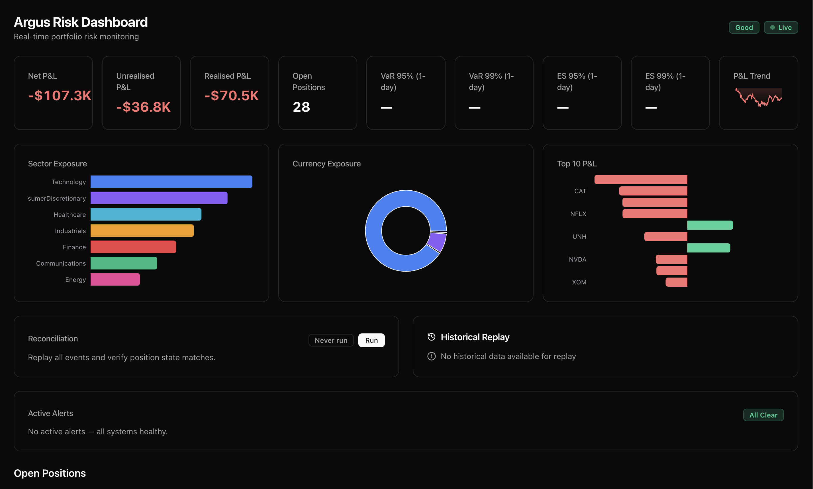
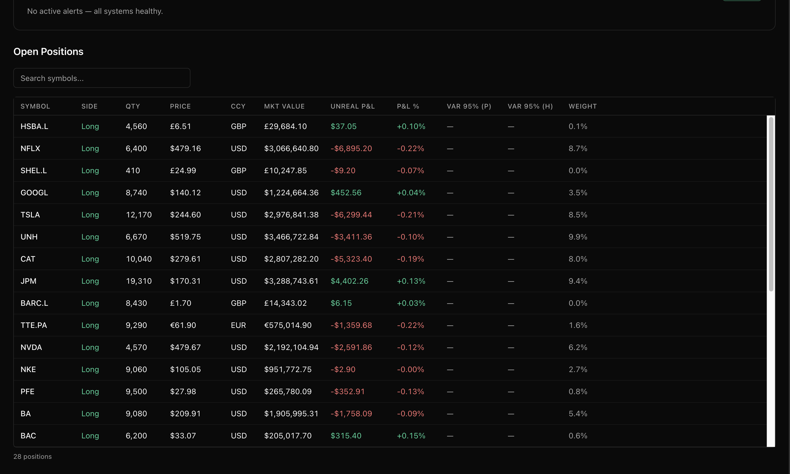

# Argus Risk

An event-driven portfolio risk simulator for exploring how trades, market data, aggregation, persistence, alerts, and live interfaces fit together in a multi-service financial system.

[](https://github.com/3ixas/argus-risk/actions/workflows/ci.yml)





## What it models

- Simulated trades, equity prices, and FX rates flowing through Kafka-compatible topics.
- FIFO position accounting, realised and unrealised P&L, currency conversion, and concentration analysis.
- Parametric and historical VaR at 95% and 99%, plus Expected Shortfall.
- Event-sourced position state with point-in-time reconstruction and reconciliation.
- Live risk updates, alert state, and historical replay through an ASP.NET Core API, SignalR, and a Next.js dashboard.
- Distributed traces, application metrics, health checks, and pre-provisioned Grafana dashboards.

Argus is a portfolio simulation, not a production trading or risk platform. Its purpose is to make the architecture, correctness controls, and failure handling inspectable in one runnable system.

## Architecture

```text
Market data simulator ─┐
                       ├─> Redpanda/Kafka ─> Risk engine ─> snapshots and alerts
Trade simulator ───────┘                         │
                                                ├─> PostgreSQL/Marten event store
                                                └─> ASP.NET Core API + SignalR
                                                                │
                                                                └─> Next.js dashboard

All services ─> OpenTelemetry ─> Prometheus / Grafana / Jaeger
```

See the [architecture deep dive](docs/architecture.md) for component, event-sourcing, data-flow, observability, reconciliation, and replay diagrams.

## Key decisions

### Kafka separates ingestion from calculation

Market data and trades arrive on independent topics. The risk engine owns position aggregation and publishes snapshots rather than coupling simulators directly to the API. This makes message boundaries, consumer behaviour, and stale-data handling explicit.

### Marten keeps state reconstructable

Position changes are stored as domain events in PostgreSQL through Marten. The current position is useful for live calculation, while the event stream provides an audit trail that can be replayed and compared against cached state.

### SignalR keeps the browser off the hot path

The API consumes published snapshots and pushes them to clients through SignalR. The dashboard does not poll the calculation engine or participate in risk processing, so a slow or disconnected browser cannot block aggregation.

## Correctness and failure handling

- FIFO accounting and risk calculations are isolated as testable domain services.
- Reconciliation replays events, computes deterministic SHA-256 checksums, and reports position differences.
- Price staleness feeds a visible data-quality state instead of silently presenting old values as current.
- Circuit breakers and alert deduplication prevent repeated dependency failures from becoming an alert storm.
- Replay mode reads persisted snapshots without replacing the live event stream.

## Run the complete system

### Prerequisites

- Docker Desktop 4.25 or later
- .NET 8 SDK for local backend development
- Node.js 20 for local frontend development

```bash
git clone https://github.com/3ixas/argus-risk.git
cd argus-risk/docker
docker compose up
```

Open `http://localhost:3000`. The Compose environment starts Redpanda, PostgreSQL, the simulators, risk engine, API, dashboard, and observability services.

Detailed service addresses, API endpoints, configuration, and operational commands are in the [operations reference](docs/operations.md).

## Verify

```bash
dotnet restore
dotnet build --no-restore
dotnet test --no-build

cd src/Argus.Web
npm ci
npm run lint
npm run type-check
npm run test
npm run build
```

The backend currently has 126 unit tests covering position events, FIFO accounting, risk and VaR calculations, caches, alerts, replay, checksums, and reconciliation. The frontend has focused tests for formatting and chart-data transformations.

## Stack

| Area | Technology |
|---|---|
| Services and domain | C# / .NET 8 |
| Event store | PostgreSQL and Marten |
| Messaging | Redpanda using Kafka protocols |
| API and live delivery | ASP.NET Core Minimal APIs and SignalR |
| Frontend | Next.js 16, React 19, TypeScript, Tailwind CSS, TanStack Table, Recharts |
| Observability | OpenTelemetry, Prometheus, Grafana, Jaeger |
| Local environment | Docker Compose |

## Limitations

- Market data, FX rates, trades, and instruments are generated locally; no exchange or reference-data feed is connected.
- The Compose topology is a single-machine development environment, not a highly available deployment.
- Authentication, authorisation, tenant isolation, and secrets infrastructure are outside the current scope.
- Risk models are educational implementations and have not been independently validated for regulatory or capital use.
- Performance thresholds are design goals only; the repository does not currently contain a repeatable benchmark proving end-to-end latency or capacity.
- The API exposes current and historical state but is not hardened for an untrusted public network.
