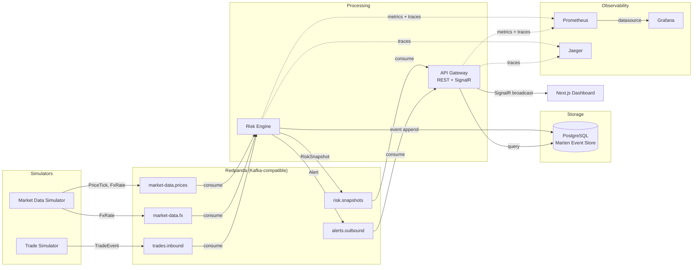
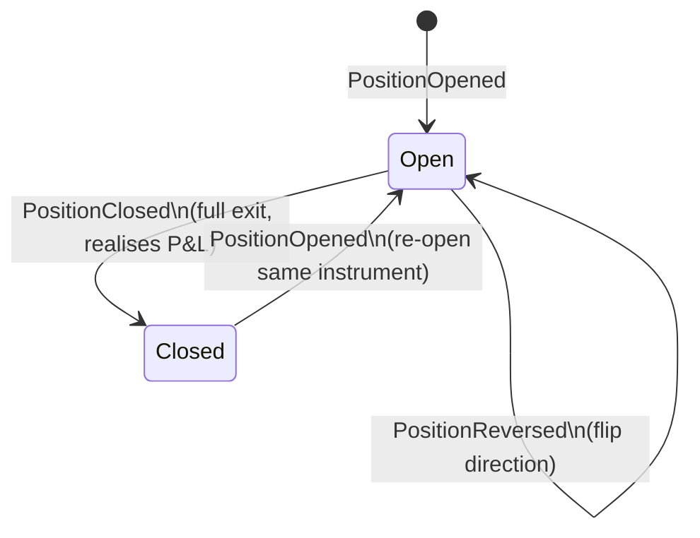
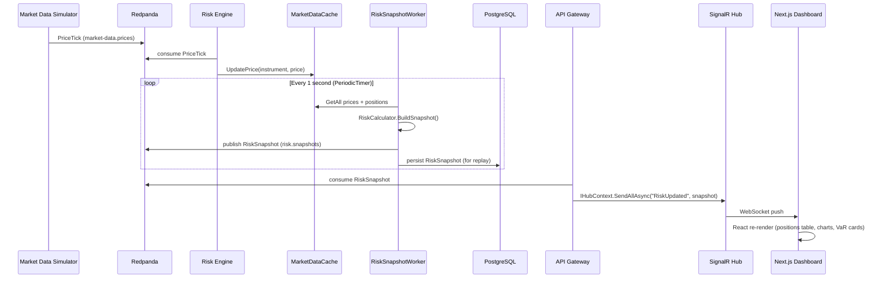

# Architecture Deep-Dive

Argus is a real-time risk aggregation platform that ingests simulated market data and trade events, computes live P&L and exposure metrics across a multi-currency equity portfolio, and streams results to a browser dashboard — all within a sub-500ms end-to-end latency target.

## System Overview

The system is composed of four .NET 8 services and one Next.js frontend, connected through Redpanda (a Kafka-compatible broker) and a shared PostgreSQL database. The Market Data Simulator generates realistic price ticks and FX rates using Geometric Brownian Motion. The Trade Simulator generates buy/sell events. The Risk Engine consumes all three streams, maintains position state via Marten event sourcing, and publishes aggregated risk snapshots back to Kafka every second. The API Gateway consumes those snapshots and broadcasts them to connected browsers over SignalR WebSockets.

Each service publishes to and consumes from Kafka independently, so they can be scaled, restarted, or replaced without coupling. Observability is cross-cutting: all .NET services export OpenTelemetry metrics to Prometheus (surfaced in Grafana) and traces to Jaeger, with W3C `traceparent` headers propagated across Kafka message boundaries so a single trade can be traced end-to-end.

## Event Sourcing — Position Lifecycle

Every change to a position is recorded as an immutable domain event appended to a Marten event stream. The current position state is always a projection — it can be discarded and rebuilt by replaying the stream from the beginning. This guarantees a full audit trail, enables point-in-time reconstruction, and makes the reconciliation feature possible: replay all events and compare the result against the live read model.

Five event types cover the full lifecycle: `PositionOpened`, `PositionIncreased`, `PositionDecreased`, `PositionReversed`, and `PositionClosed`. Realised P&L is calculated at event creation time using a FIFO cost basis calculator (a pure static function with no I/O dependencies) and stored on the event itself — the `Apply` methods in the `Position` aggregate trust the pre-computed values and maintain the internal cost-lot list for future calculations. Because every trade maps to exactly one event, the stream for any instrument can be replayed in microseconds to reconstruct any historical state.

## Real-Time Risk Pipeline

The end-to-end latency target is p99 < 500ms from a price change arriving at Redpanda to the updated metric appearing in the browser. The pipeline is deliberately simple: prices flow into a cache, a timer fires every second to compute a snapshot, and that snapshot is pushed to the browser over WebSocket.

The 1Hz snapshot cadence is driven by `PeriodicTimer` (not `Task.Delay`) so the interval accounts for processing time — if snapshot computation takes 50ms, the next tick still fires 1s later, not 1.05s. Price updates land in `MarketDataCache` (a `ConcurrentDictionary`) on the consumer thread and are read by the snapshot worker on its own thread with no locking — lock-free reads at high throughput. Each snapshot is also persisted to PostgreSQL synchronously before the next loop iteration, enabling the replay feature to stream any historical window back to the dashboard at 1x–60x speed.

## Key Design Decisions

- **Event Sourcing via Marten** — Positions are append-only event streams stored in PostgreSQL. This gives a full audit trail, enables point-in-time reconstruction for reconciliation, and makes the replay feature trivial to implement: query snapshots by timestamp range and stream them back in order.

- **Kafka-first data flow** — Every service communicates exclusively through Redpanda topics, never direct HTTP calls. Each service has its own consumer group and offset tracking, so a restart doesn't cause data loss and each component can be scaled or replaced independently without affecting others.

- **Pure static functions for risk calculations** — `FifoCostBasisCalculator`, `RiskCalculator`, `VaRCalculator`, and `PortfolioChecksumCalculator` are all pure static functions with zero infrastructure dependencies. Given the same inputs they always return the same outputs, making them trivially unit-testable and deterministically replayable.

- **Dual-cache architecture in Risk Engine** — `MarketDataCache` holds the latest prices and FX rates; `PositionCache` holds the current open positions projected from Marten at startup and kept in sync after each trade. Both use `ConcurrentDictionary` for lock-free reads. The snapshot worker combines both caches to compute the full portfolio view without touching the database on the hot path.

- **`PeriodicTimer` for snapshots** — `PeriodicTimer` fires every 1s accounting for processing time elapsed inside the loop body, unlike `Task.Delay(1000)` which would drift by the processing duration on every iteration. At 1Hz with modest position counts the difference is small, but the pattern is correct for any production timer loop.

- **SignalR for dashboard updates** — Rather than polling the REST API, the dashboard maintains a persistent WebSocket connection to the SignalR hub. The API gateway pushes each snapshot the moment it is consumed from Kafka, achieving sub-100ms browser update latency with no polling overhead or stale-data windows.
